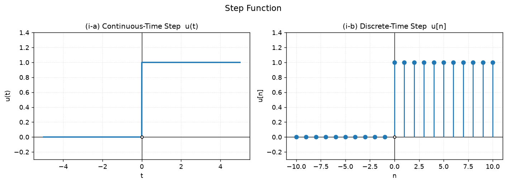
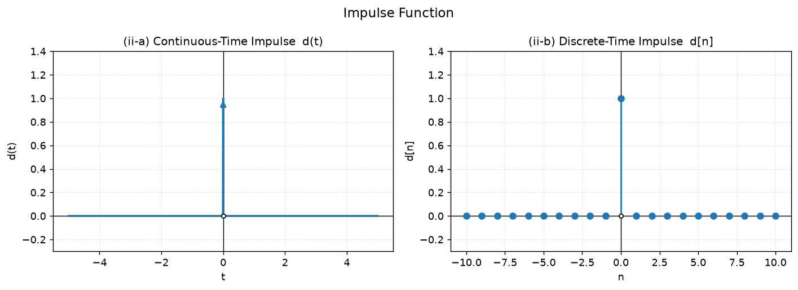
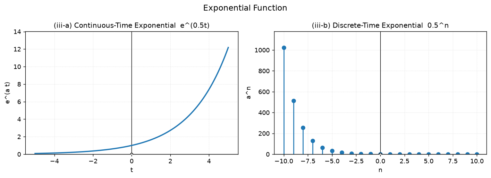
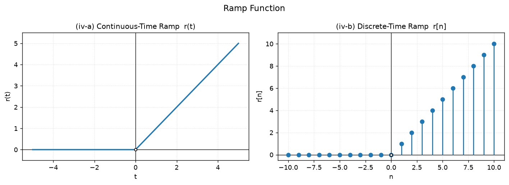
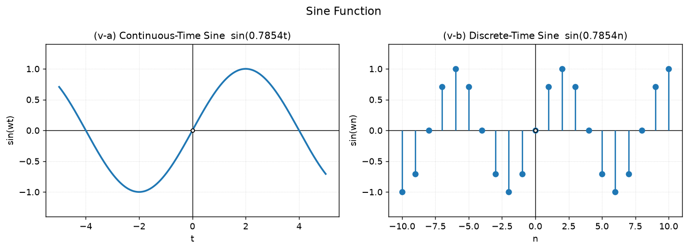

# Generation of Discrete-Time Signals

Plots the **continuous-time (CT)** and **discrete-time (DT)** forms of five
basic signals, as required by the assignment:

| # | Signal | Continuous-time | Discrete-time |
|---|--------|-----------------|---------------|
| i | Step | `u(t) = 1, t ≥ 0` | `u[n] = 1, n ≥ 0` |
| ii | Impulse | `d(t)` (Dirac delta) | `d[n]` (Kronecker delta) |
| iii | Exponential | `e^(at)` | `a^n` |
| iv | Ramp | `r(t) = t, t ≥ 0` | `r[n] = n, n ≥ 0` |
| v | Sine | `sin(ωt)` | `sin(ωn)` |

## Files

| File | Purpose |
|------|---------|
| `signal_generation.py` | Main solution — numpy + matplotlib, PNG output |
| `signal_generation_pure.py` | Zero-dependency fallback — pure-stdlib SVG output |
| `signal_generation.m` | MATLAB version of the same five plots |
| `verify_signals.py` | Numerical self-test asserting each signal's defining properties |

## Running locally

```bash
pip install numpy matplotlib
python signal_generation.py        # writes figures/
python signal_generation_pure.py   # writes figures_pure/
python verify_signals.py           # exits non-zero if any property fails
```

MATLAB (Octave also works):

```matlab
>> signal_generation
```

## Generated plots

Figures are produced by GitHub Actions and committed to `docs/figures/`.
Download the latest run's `signal-plots` artifact for all PNGs and SVGs.

| Signal | Plot |
|--------|------|
| Step |  |
| Impulse |  |
| Exponential |  |
| Ramp |  |
| Sine |  |

## Notes on the signals

**Step** — defined as 1 from the origin onward, 0 before. It is the discrete
integral of the impulse, `u[n] − u[n−1] = d[n]`.

**Impulse** — the continuous-time impulse is a Dirac delta with *infinite*
height and *zero* width, so it cannot be drawn as an ordinary point. It is
rendered as a unit arrow at the origin. The discrete-time impulse is an
ordinary sequence value: `d[n] = 1` at `n = 0`, 0 elsewhere, and its sum is
exactly 1.

**Exponential** — the DT form is the CT form sampled at the integers:
`aⁿ = e^(an)`. Choosing `0 < a < 1` gives decay toward zero; `a > 1` gives
growth.

**Ramp** — `r[n] − r[n−1] = u[n]`, i.e. the ramp is the running sum of the
step.

**Sine** — note the aliasing difference. The CT sine `sin(ωt)` is not
periodic, but sampling it at `t = n` with `ω = π/4` yields a DT sequence that
*is* periodic, with period `N = 2π/ω = 8`. This is the clearest illustration
of why discrete-time and continuous-time signals must be treated separately.

## CI

`.github/workflows/generate-plots.yml` installs the dependencies, runs both
generators, runs `verify_signals.py`, asserts all six PNGs and five SVGs
exist, uploads them as the `signal-plots` artifact, then commits the figures
back to `docs/figures/`.